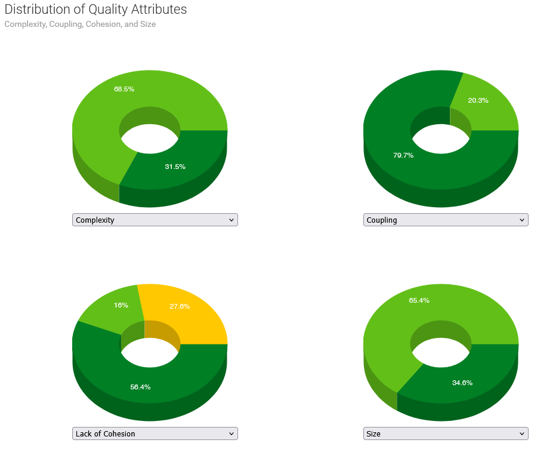
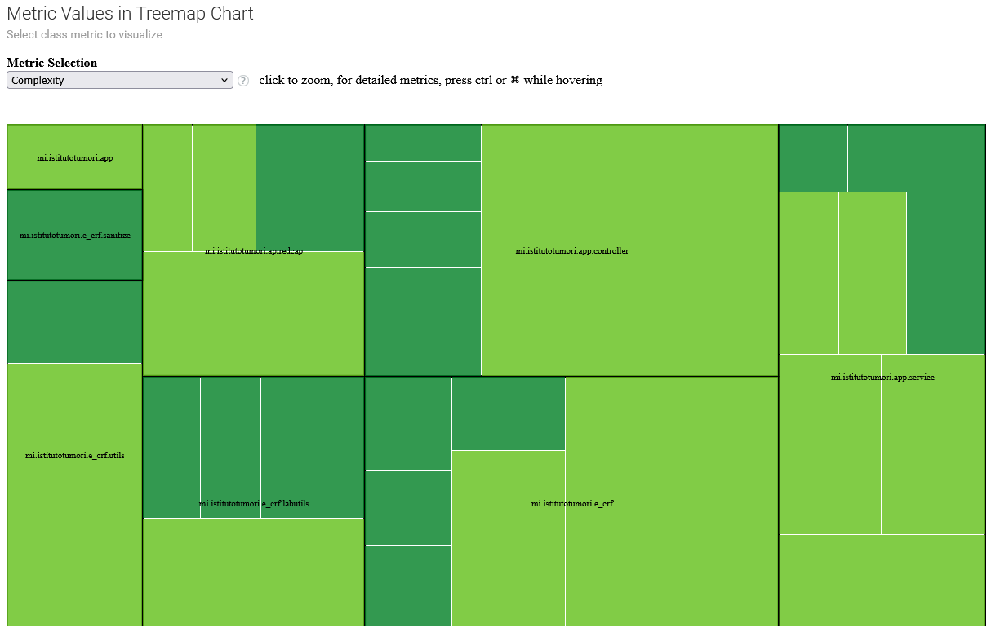
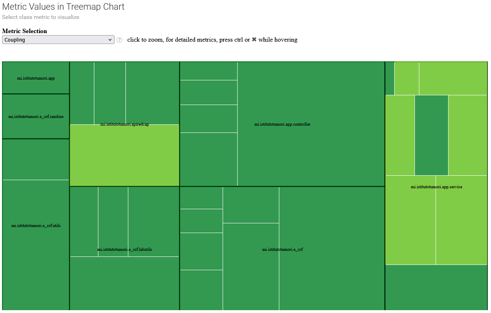
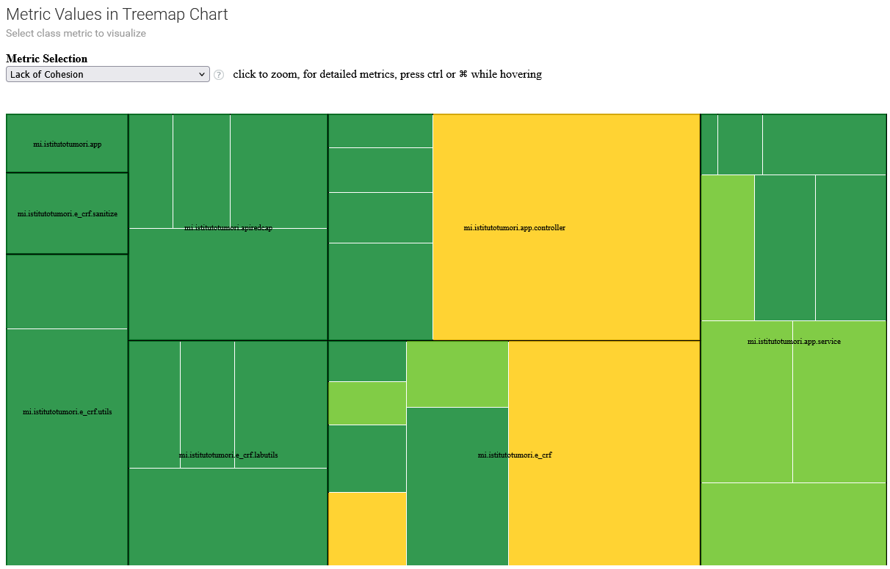

# DESIGN

## Software Architecture
### 1. ***Introduzione***

Il sistema eCRF Generator con REDCap è un applicativo software sviluppato in linguaggio Java con l’obiettivo di **automatizzare la generazione di instrument eCRF** (electronic Case Report Form) per studi clinici gestiti tramite la piattaforma REDCap.

Il sistema si colloca in un contesto clinico-regolato, caratterizzato da:
- elevata variabilità dei requisiti funzionali;
- necessità di tracciabilità e audit;
- vincoli di conformità a normative (GDPR, GCP);
- forte integrazione con sistemi esterni (REDCap).

La presente sezione descrive l’architettura del sistema, adottando più Architectural View per analizzare il sistema secondo differenti punti di vista.

---

### 2. ***Obiettivi Architetturali***

Le principali decisioni architetturali sono guidate dai seguenti obiettivi:
- **Manutenibilità**: facilitare l’evoluzione del sistema in presenza di nuovi tipi di instrument o regole cliniche;
- **Modularità**: separare chiaramente dominio, orchestrazione applicativa e integrazione esterna;
- **Riusabilità**: favorire il riutilizzo di componenti per strumenti standard e personalizzati;
- **Affidabilità**: gestire errori di rete, dati incompleti e incongruenze;
- **Portabilità**: consentire l’esecuzione su sistemi Windows e Linux;

Compliance: supportare audit trail, logging e tracciabilità.

---

### 3. ***Architectural Views***
#### 3.1 Logical View (Vista Logica a Componenti e Connettori)
#### *Descrizione*
La Logical View descrive la struttura del sistema in termini di *responsabilità funzionali* e *suddivisione in livelli*, indipendentemente dai dettagli di esecuzione.

L’architettura cerca di replicare uno stile **Client-Server** con pattern **MVC** e **Factory**
```
┌────────────────────────────────────────────────────────────────────────┐
│                         APPLICAZIONE DESKTOP (JavaFX)                  │
├────────────────────────────────────────────────────────────────────────┤
│  PRESENTATION LAYER (JavaFX) │  BUSINESS LAYER (Java) │  DATA LAYER    │
│  ─────────────────────────── │  ────────────────────  │  ───────────   │
│  • Controllers (FXML)        │  • Service Classes     │  • API Clients │
│  • View (.fxml)              │  • Domain Objects      │  • Cache       │
│  • CSS Themes                │  • Factories           │  • JSON/CSV    │
│                              │  • Builders            │    Serializers │
└────────────────────────────────────────────────────────────────────────┘
                                     │
                                     ▼
┌──────────────────────────────────────────────────────────────────────┐
│                        REDCAP SERVER (Esterno)                       │
├──────────────────────────────────────────────────────────────────────┤
│  • API REST (HTTP/HTTPS)                                             │
│  • Database REDCap                                                   │
│  • Progetti Survey e Standard                                        │
└──────────────────────────────────────────────────────────────────────┘
```
---

#### *Componenti principali*:
- **Frontend (JavaFX)**:
  - *<u>MainApp</u>*: Punto di ingresso, gestione scene/stage
  - *<u>RootController</u>: Controller principale con tab pane
  - Controller specifici per tab (*<u>LabController</u>*, *<u>StandardController</u>*, ecc.)

- **Business Layer**:
  - *<u>BaseRunnerService</u>*: Template method per operazioni comuni
  - RunnerService specializzati (*<u>LabRunnerService</u>*, *<u>StandardRunnerService</u>*, ecc.)
  - *<u>ApiService</u>*: Facade per chiamate API REDCap
  - *<u>InstrumentFactory</u>*: Factory per creazione strumenti
  - *<u>InstrumentsProjBuilder</u>*: Builder per progetti di strumenti

- **Domain Model**:
  - *<u>AbstractInstrument</u>*: Interfaccia base per strumenti
  - *<u>LabInstrument</u>*, *<u>StandardInstrument</u>*: Implementazioni concrete
  - *<u>Field</u>*: Entità base con pattern Builder
  - *<u>InstrumentsProj</u>*: Contenitore di strumenti

- **Data Access/External Integration**:
  - *<u>AbstractApiRedcap</u>*: Classe astratta per chiamate API
  - *<u>ApiRecord</u>*, *<u>ApiMetaData</u>*: Implementazioni specifiche
  - *<u>SerializeInst2CsvString</u>*, *<u>SerializeInst2JsonString</u>*: Serializzatori / Deserializzatori flusso informazioni

#### *Connettori*:
- *<u>HTTP/HTTPS</u>*: Per comunicazione con API REDCap
- *<u>JavaFX</u>*:  Binding tra View e Controller
- *<u>Java</u>*:  Method Calls tra componenti business layer
- *<u>File I/O</u>*: Per salvataggio CSV e lettura/scrittura JSON

---

#### 3.2 Vista di Sviluppo (package e dipendenze)
**Organizzazione Packages e Classi**
```
├── app
│   ├── MainApp.java                    # Entry point JavaFX
│   ├── controller
│   │   ├── RootController.java         # Controller principale
│   │   ├── LabController.java          # Controller tab Lab
│   │   ├── StandardController.java     # Controller tab Standard
│   │   ├── EotEosController.java       # Controller tab EOT/EOS
│   │   └── QoLController.java          # Controller tab QoL
│   └── service
│       ├── BaseRunnerService.java      # Template method base
│       ├── LabRunnerService.java       # Servizio Lab
│       ├── StandardRunnerService.java  # Servizio Standard
│       ├── EotEosRunnerService.java    # Servizio EOT/EOS
│       ├── QoLRunnerService.java       # Servizio QoL
│       ├── RunnerService.java          # Facade servizi
│       ├── RunnerServiceUtils.java     # Utilities
│       └── TabResult.java              # DTO risultato
│
├── apiredcap
│   ├── AbstractApiRedcap.java          # Astratta API REDCap
│   ├── ApiRecord.java                  # API per record
│   ├── ApiMetaData.java                # API per metadata
│   └── ApiService.java                 # Service layer API
│
├── e_crf
│   ├── AbstractInstrument.java         # Interfaccia strumenti
│   ├── Field.java                      # Modello field REDCap
│   ├── LabInstrument.java              # Strumento laboratorio
│   ├── StandardInstrument.java         # Strumento standard
│   ├── InstrumentFactory.java          # Factory strumenti
│   ├── InstrumentsProj.java            # Progetto strumenti
│   └── InstrumentsProjBuilder.java     # Builder progetti
│
├── e_crf.labutils
│   ├── ConstData.java                  # Costanti JSON
│   ├── WorkingLists.java               # Liste di lavoro lab
│   ├── WorkingDataBuilder.java         # Builder dati lab
│   └── HtmlNestedTableBuilder.java     # Builder HTML tabelle
│
└── e_crf.utils
    ├── SerializeInst2CsvString.java    # Serializzatore CSV
    ├── SerializeInst2JsonString.java    # Serializzatore JSON
    └── RedcapSanitizer.java            # Sanitizzatore dati
```
	
#### *Dipendenze tra Packages*:
- app → apiredcap, e_crf, e_crf.utils
- apiredcap → librerie HTTP client
- e_crf → e_crf.labutils, e_crf.utils
- e_crf.labutils → apiredcap

---

#### 3.2 Vista Fisica (deployment)
```
┌─────────────────────────────────────────────────────────┐
│                   WORKSTATION UTENTE                    │
├─────────────────────────────────────────────────────────┤
│  • Java Runtime Environment (JRE/JDK 17+)               │
│  • Applicazione Java (JAR + script BAT)                 │
│  • Connessione internet (per API REDCap)                │
│  • Accesso a filesystem locale (salvataggio CSV)        │
└────────────────────────┬────────────────────────────────┘
                         │ HTTP/HTTPS
                         ▼
┌───────────────────────────────────────────────────────┐
│             SERVER REDCap (ISTITUTO)                  │
├───────────────────────────────────────────────────────┤
│  • REDCap v13+ con API abilitate                      │
│  • Database MySQL/PostgreSQL                          │
│  • Progetti:                                          │
│      - Survey eCRF (per input)                        │
│      - eCRF Tools (standard)                          │
│      - Progetti target (per import)                   │
└───────────────────────────────────────────────────────┘
```

- **Requisiti di deployment**:
  - File JAR eseguibile
  - Script BAT per configurazione JavaFX
  - JRE 17+ installato
  - Connessione all'istanza REDCap dell'istituto
  - Permessi API sul progetto REDCap target
  
---

### 4. ***Librerie esterne utilizzate***
- **Core Java & JavaFX**:
  - Java SE 17+: Runtime base
  - JavaFX 17+: GUI framework (controlli, scene, CSS)
  - Java Collections Framework: Strutture dati
  
- **HTTP Client & Networking**:
  - Apache HttpClient 4.5+: Per chiamate HTTP alle API REDCap
  - HttpClient, HttpPost, HttpResponse
  - Gestione parametri, headers, encoding
  
- **JSON Processing**:
  - Jackson Databind 2.15+: Serializzazione/deserializzazione JSON
    - ObjectMapper, JsonNode, ArrayNode
    - Annotazioni @JsonProperty
  - Jackson Core: Supporto base JSON
  
- **CSV Processing**:
  - OpenCSV 5.7+: Lettura/scrittura file CSV
    - CSVReader, CSVReaderBuilder
    - Gestione encoding, delimiter, quote
	
- **Logging**:
  - Log4j 2.20+: Logging avanzato
    Logger separati per diversi contesti (exception, API, dati)
	 - file **"BranchingLogicBloccanti.log"** tiene traccia delle variabili che bloccano il caricamento dei progetti perchè presenti nella sintassi delle *branching-logic* ma assenti come campi in tutti gli instruments
	 - file **"dataStructWL.log"** tiene traccia delle strutture dati costriute come meta-dati per la formazione dell'instrument del laboratorio
	 - file **"return_api.log"** tiene traccia delle comunicazioni attraverso le api e delle request response formulate
	 - file **"error.log"** tiene traccia degli errori nella comunicazione usato soprattutto nei controller
	 - file **"test_output.log"** file di servizio usato nei casi di test
	 
- **PDF Generation**:
  - Apache PDFBox 2.0+: Generazione PDF per documentazione

- **Build & Dependency Management**:
  - Maven: Gestione dipendenze e build

---

### 5. ***STILI ARCHITETTURALI***
- **Client-Server**:
  - Applicazione desktop come client
  - Server REDCap come backend
  - Comunicazione tramite API REST
  
- **Model-View-Controller (MVC)**:
  - *<u>Model</u>*: Field, AbstractInstrument, InstrumentsProj
  - *<u>View</u>*: File FXML con layout JavaFX
  - *<u>Controller</u>*: Classi *Controller* che gestiscono eventi UI
  
- **Builder**:
  - *Field.FieldBuilder* per costruzione complessa di campi
  - *InstrumentsProjBuilder* per costruzione fluente di progetti
  
- **Factory**:
  - *InstrumentFactory* crea strumenti in base al tipo
  - *ApiRecord.surveyRecord()*, *ApiMetaData.surveyMetaData()* come factory statiche
	
- **Facade**:
  - *ApiService* nasconde complessità API REDCap
  - *RunnerService* fornisce interfaccia unificata per tutti i servizi

- **Strategy** (forse!):
  - Diversi *RunnerService* implementano stessa interfaccia di esecuzione
    - Scelta strategia in base al tab selezionato
	
---

### 6. ***Considerazioni***
- **Punti di forza**:
  - Separazione chiara delle responsabilità
  - Alta coesione e basso accoppiamento tra moduli
  - Estensibilità attraverso factory e template method
  - Riusabilità componenti (Field, Instrument, API client)
  
- **Aree di miglioramento potenziale**:
  - Cache API
  - Gestione errori e cattura eccezioni
  - Configurazione hardcoded (URL API, path) - rendere configurabile
  - Logica Client - Server completa con sviluppo di una web-app

---

## Descrizione del Design
Si rimanda all'insieme dei diagrammi UML "linkabili" dalla pagina principale per una descrizione completa e/o parziale dell'architettura, del comportamento e della distribuzione di tutti i componenti del progetto.

## Analisi di Complessità

### 1. ***Riepilogo dei metodi più complessi trovati***

| Metodo                               | Complessità | Note                                   |
|--------------------------------------|-------------|----------------------------------------|
| **AbstractApiRedcap (costruttore)**  | **16**      | Molti parametri opzionali              |
| **AbstractApiRedcap.doPost()**       | **7**       | Try/catch + if + while                 |
| **ApiService.getMetadata()**         | **6**       | Switch + OR + early return             |
| **Field.fromLabItem()**              | **3**       | Rami multipli                          |
| **Field.sanitize()**                 | **3**       | Condizione composta                    |
| **ApiService.getStandardToolsMetadata()** | **3**   | Condizione composta                    |


- **AbstractApiRedcap (costruttore)** risulta un metodo complesso perchè ha molti parametri, in realtà ho radunato li tutti i parametri possibili per tutte le API messe a disposizione che poi gia riduco/seleziono con i metodi delle classi API concrete.
- **AbstractApiRedcap.doPost()** esempio di calcolo:
  - codice del metodo  
  ```
	String doPost() {
		resp = null;

		try {
			resp = client.execute(post);
		} catch (final Exception e) {
			e.printStackTrace();
		}

		if (resp != null) {
			respCode = resp.getStatusLine().getStatusCode();

			try {
				reader = new BufferedReader(new InputStreamReader(resp.getEntity().getContent()));
			} catch (final Exception e) {
				e.printStackTrace();
			}
		}

		if (reader != null) {
			try {
				while ((line = reader.readLine()) != null) {
					result.append(line);
				}
			} catch (final Exception e) {
				e.printStackTrace();
			}
		}
		return result.toString();
	}```

**Decision points**
- if (resp != null) → 1
- if (reader != null) → 1
- while ((line = reader.readLine()) != null) → 1
- 3 blocchi catch → 3  
Totale decision points = 6  
<p><u>Complessità ciclomatica</u>: &nbsp;&nbsp;&nbsp; <b>M = 1 + 6 = 7</b> &nbsp;&nbsp; (ho usato la formula semplificata, in alternativa con quella applicata durante le prove in itinere)</p>

---

### 2. ***Descrizione di esempio di analisi dei cicli presenti fatto con StanIDE e JDepend e relativo refactoring per la riduzione del rischio di presenza del ciclo.***
Ho cercato di riorganizzare e migliorare il più possibile la parte che riguarda la **"Business Logic"**, la formazione delle strutture dati che vanno a comporre il progetto REDCap. In sostanza queste attività sono raggruppate nei packages ***mi.istitutotumori.e_crf***, ***mi.istitutotumori.apiredcap*** e relativi sotto packages.  
Qui faccio un esempio di **rifattorizzazione** che ho applicato per ***mitigare il rischio di avere un ciclo*** tra classi/packages.  

#### INIZIO: individuazione del ciclo
Ho usato gli strumenti:
- Dependency Viewer <a href="./refactoringCicloProbabile/1_DependencyViewer.png">screenshot con ciclo</a></li>
- StanIDE <a href="./refactoringCicloProbabile/1_StanIDECycle.png">screenshot con ciclo</a></li>
- JDepend <a href="./refactoringCicloProbabile/1_JDependCycle.png">screenshot con ciclo</a></li>
#### ATTIVITÀ: analisi e correzione del rischio di ciclo
Dall'analisi delle dipendenze e delle chiamate dei metodi mi sono accorto che erano coinvolti metodi di utilità "generale" che controllano la serializzazione / deserializzazione dell'informazione (formato testo ma formattato in piu modalità: html, SQL, "branching logic") che viene scambiata tra gli oggetti ed ho creato un package ad hoc con la classe SanitizerApi.java. Ho fatto così perche in futuro dovrei riorganizzare altre parti di codice che svolgono la stessa attività (ad esempio nella classe Field.java ho un metodo che andrebbe riportato qui).  
#### FINE: verifica di assenza del rischio di ciclo
Risultato dopo la rifattorizzazione:  
- Dependency Viewer <a href="./refactoringCicloProbabile/2_DependencyViewerNOciclo.png">screenshot senza ciclo</a></li>
- StanIDE <a href="./refactoringCicloProbabile/2_StanIdeNOciclo.png">screenshot senza ciclo</a></li>
- JDepend <a href="./refactoringCicloProbabile/2_JDependNOCicliTranneViewController.png">screenshot senza ciclo</a></li>

Infine mi sono avvalso degli strumenti *<u>UCDetector</u>*, *<u>PMD</u>* e *<u>SonarQube</u>* per l'analisi della sintassi apportando migliorie a codice duplicato, corretto uso dei modificatori di accesso, eliminazione di codice inutile (anche se ho lasciato qualche istruzione "print.." utilizzata come debug, soprattutto in qualche classe di test ed in alcuni casi è presente codice non attivo che presumo possa servire in futuro), etc... .

----

## Design Pattern
Nel package ***mi.istitutotumori.e_crf*** dove definisco la struttura dati di un eCRF, che sarà un po' la pietra miliare di tutto il progetto, ho provato ad utilizzare i "pattern" di costruzione degli oggetti come il ***FACTORY*** e il ***BUILDER*** patterns per isolare ed avere più controllo sulla formazione di oggetti come gli **instruments** ed il **project**.  
Ho documentato la logica di sviluppo in un diagramma delle classi fatto con Papyrus ed anche il codice è stato quasi interamente generato in modo automatico con quello strumento (NB comunque ho tenuto Papyrus su una distro separata di eclipse per i continui errori e problemi di versione delle librerie che presentava se configurato sulla distribuzione "master" di eclipse JEE 2025-12).  
Questa è la parte di codice dove ho cercato di utilizzare un Design Pattern intenzionalmente ma dalla rilettur adel codice sembra i notare che:
1) ***Factory*** è presente in più punti (sottoforma di **metodi static**):
  - *ApiRecord.surveyRecord*(...)
  - *ApiMetaData.surveyMetaData*(...)
  - *ApiMetaData.standardToolsMetaData*(...)
  - *RunnerServiceUtils.create*(...)
  - *RunnerServiceUtils.createWithBuilder*(...)  
  
 Ogni metodo statico incapsula la logica di creazione di un oggetto complesso, nascondendo i costruttori e restituendo sottoclassi o varianti configurate.
 
2) ***Builder***, usato anche in:
  - *Field.FieldBuilder*
  - *WorkingDataBuilder* (forse un po "atipico", solo di nome)
  - *HtmlNestedTableBuilder* (builder specializzato per HTML)  
  Costruisce oggetti complessi passo‑passo, con metodi fluenti e separazione tra costruzione e rappresentazione.
  
3) ***Singleton***:
  - *ApiService* è una classe final con soli metodi statici e cache statica → singleton "funzionale"
  
4) ***Facade*** sembra presente in *RunnerService* che espone un’interfaccia semplice (runLab, runStandard, runEotEos, runQoL) e nasconde la complessità dei vari servizi.  
Nasconde la complessità dei vari RunnerService e fornisce un unico punto di accesso.

---

## Metriche
Data la difficolta nell'utilizzare StanIDE ho fatto una ricerca in rete ed ho trovato un Plug-in che calcola la maggior parte delle emtriche viste a lezione, le espone con interfacce html e ne dà anche una classificazione.  
Questo strumento si chiama <a href=https://www.codemr.co.uk/>CodeMR</a> e qui espongo alcuni diagrammi e grafici rigurdanti le metriche del mio progetto <a href=../codice/e_crf/codemr/e_crf/html/main_report/htmlx/lbd/dashboard.html>link</a>  
Di seguito mostro degli sceenshot con diagrammi che esprimono il grado delle varie metrice; i valori peggiori li ho nei packages della GUI (view e controller) e sulla classe Field dove al momento per semplicità ho "radunato" un po troppe cose, considerandola una classe "atomica", essenziale!  

  

  

  

 


	
	
	

