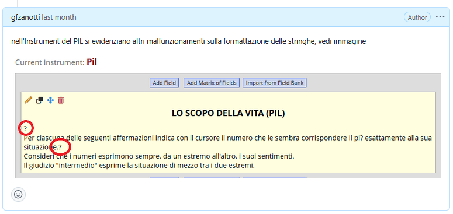
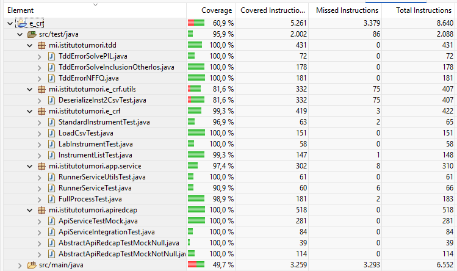
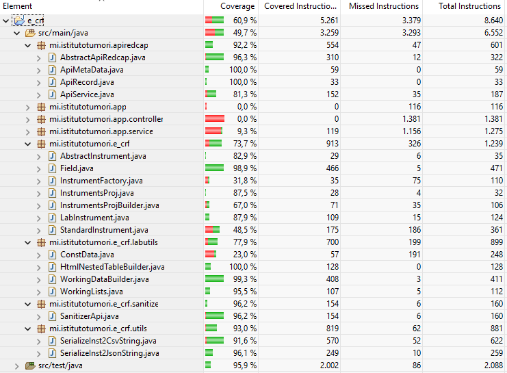

# Piano di Test (IEEE 829:2008)

## 1. Identificazione del Documento

| Campo | Descrizione |
|-------|-------------|
| ID Documento | STD-TEST-001 |
| Progetto | E-CRF (Electronic Case Report Form) |
| Versione | 0.1.5 |
| Data | 15.01.2026 |
| Autore | Gianfranco Zanotti |
| Stato | Bozza |
| Piattaforma di Test | JavaFX 21.0.2, JUnit 5, Maven |

## 2. Introduzione

### 2.1 Scopo del Documento
Questo documento descrive la *strategia, i piani e i casi di test* per il **progetto E-CRF** (un'applicazione desktop JavaFX per la gestione di dati clinici con REDCap). Il diagramma UML delle classi allegato (Link) definisce l'architettura del sistema oggetto di test.

L'obiettivo è garantire la qualità delle funzionalità di ***gestione strumenti***, ***conversione dati***, e ***integrazione API***.

### 2.2 Obiettivo del Test
- Verifica delle classi core (packages redcap.api ed e_crf).
- Test delle API REDCap (AbstractApiRedcap, ApiMetadata, ApiRecord).
- Validazione della UI JavaFX (RootController, StandardController, LabController).
- Testing dei servizi di conversione dati (RedcapConverter, HtmlNestedTableBuilder).

### 2.3 Definizioni e Acronimi

| Termine | Definizione |
|---------|-------------|
| IEEE 829 | Standard per la documentazione del software testing |
| E-CRF | Electronic Case Report Form |
| REDCap | Research Electronic Data Capture (piattaforma per dati di ricerca) |
| JavaFX | Framework per GUI desktop in Java |
| JUnit | Framework per unit testing in Java |

## 3. Strategia di Test

### 3.1 Livelli di Test

| Livello | Tecnica | Strumenti | Classi Target (esempi) |
|---------|---------|-----------|------------------------|
| Unit Test | Test delle singole classi | JUnit 5, Mockito | Field, WorkingDataBuilder, RedcapConverter |
| Integration Test | Interazione tra classi | JUnit 5 | RunnerService → ApiService, InstrumentList → AbstractInstrument |
| Acceptance Test | Requisiti utente | Manuale | Flusso completo: import REDCap → conversione → export formato .csv o tramite API |

### 3.2 Criteri di Pass/Fail
- Unit Test: 100% dei test devono passare (con coverage minimo del 70% sulle classi core).
- Integration Test: Tutte le chiamate API simulate devono restituire risultati coerenti.
- System Test: L'interfaccia utente deve rispondere entro 2 secondi per ogni operazione ed avere comportametni / risposte coerenti.

### 3.3 Funzionalità non da Testare
- Aspetti non deducibili dal diagramma (es. performance specifica in produzione, sicurezza applicativa avanzata, UI estetica).

## 4. Piani di Test

### 4.1 Piano di Unit Test
**Obiettivo**: Verifica del comportamento delle singole classi.

| ID Test | Classe Sotto Test | Scenario | Input | Output Atteso |
|---------|-------------------|----------|-------|---------------|
| UT-001 | Field | Creazione campo con valori validi | fieldName="patient_id", fieldType="text" | Oggetto Field con attributi corretti |
| UT-002 | WorkingDataBuilder | Costruzione arrayEsteso da dati REDCap | Lista di valori RAW REDCap | List<String> strutturata |
| UT-003 | RedcapConverter | Conversione JSON REDCap → CSV | Nodo JSON con 3 campi | Stringa CSV con 3 righe |
| UT-004 | ApiService | Cache metadata dopo prima chiamata | token="ABC123", form="demographics" | Cache popolata, seconda chiamata veloce |

*eventuale esempio di test di unità*

### 4.2 Piano di Integration Test
**Obiettivo**: Verifica delle interazioni tra componenti.

| ID Test | Componenti Integrati | Scenario | Mock/Stub | Risultato Atteso |
|---------|----------------------|----------|-----------|------------------|
| IT-001 | RunnerService → ApiService | Esecuzione flusso "Lab" con dati mock | Mock di ApiService con dati JSON | File PDF generato in outputDir |
| IT-002 | InstrumentList → AbstractInstrument | Costruzione bundle da 3 strumenti standard | Lista di 3 StandardInstrument | Bundle con tutti i campi uniti |
| IT-003 | WorkingLists → HtmlNestedTableBuilder | Generazione HTML per tabella nidificata | nestedTableData di esempio | Stringa HTML valida con \<table\> |

*eventuale esempio di test di integrazione*

### 4.3 Piano di Acceptance Test
**Obiettivo**: convalidare e collaudare l'aderenza dell'applicazione alle richieste (requisiti) dell'utente.

##### *STRUMENTI DA UTILIZZARE*
- App (GUI) REDCap
- REDCap client web (per la verifica del funzionamento delle APIe la validazione degli import)
- Notepad++ per verificare la memorizzazione dei file .csv con la giusta struttura
- connessione VPN

##### *ATTIVITA' INIZIALI COMUNI*
  * Lo sviluppatore fornisce una versione del file eseguibile. 
  * Il tester crea un nuovo progetto in REDCap e abilita l'utenza "etl_dwh" nel caso necessiti l'accesso al progetto con i permessi di utilizzo delle API. 
  * Il tester richiede per l'utente "etl_dwh" il token delle API. L'amministratore di REDCap accetta la richiesta e l'utente "etl_dwh" lo visualizza.
  
##### test nuovo rilascio file .jar e utilizzo del tab "STANDARD" con uso delle API
  * Il tester avvia l'applicazione fornita dallo sviluppatore e clicca sulla tab "STANDARD"
  * Il tester copia il token visualizzato in REDCap nell'interfaccia, compila il campo con il numero del record della survey da utilizzare, indica che **non va creato** lo strumento del laboratorio e decide di far girare l'applicativo utilizzando il metodo di scrittura con le API
  * Il tester attende che l'interfaccia restituisca il messaggio che ha finito l'attività e controlla che nell'ultima riga venga riportato il numero di righe scritte in REDCap
  * Il tester controlla che in REDCap siano stati creati tutti gli strumenti previsti dalla tab "STANDARD"


##### test nuovo rilascio file .jar e utilizzo del tab "STANDARD" con file CSV
  * Il tester avvia l'applicazione fornita dallo sviluppatore e clicca sulla tab "STANDARD"
  * se il tester non inserisce alcun parametro ed esegue (clicca sul tasto) "***Run***" viene visualizzato un messaggio che ricorda di inserire il *Record Id* (mandatorio per determinare il tipo di Trial)

  * Il tester compila il campo con il numero del record della survey da utilizzare, sceglie dalla seconda "combo" se vuol costruire un nuovo progetto o accodare i dati a un progetto già esistente (in questo caso è mandatorio il TOKEN), e decide di far girare l'applicativo utilizzando il metodo di creazione del file CSV (scelta della prima "combo").
  * Il tester attende che l'interfaccia restituisca il messaggio che ha finito l'attività e controlla che il file CSV sia stato generato correttamente.
  * Il tester carica il file CSV in "Data Dictionary".
  * Il tester controlla che in REDCap siano stati creati tutti gli strumenti previsti dalla tab "STANDARD"
  
##### test nuovo rilascio file .jar e utilizzo del tab "LAB" con file CSV
  * Il tester avvia l'applicazione fornita dallo sviluppatore e clicca sulla tab "LAB" (selezionato di default)
  * se il tester non inserisce alcun parametro ed esegue (clicca sul tasto) "***Run***" (quindi senza parametri) viene memorizzato solo il file .csv
  * se il tester esegue il "***Run***" scegliendo come output (scelta combo) "*importa dati con API*" non avendo inserito altri campi -> importa i dati nel progetto "Nuova CRF Base (bozza)"; cancella il pregresso e memorizza il laboratorio scelto (se non c'è scelta viene preso il Record 1 del progetto "Survey eCRF")
  * Il tester  esegue il "***Run***" impostando: 
    - Token
	- survey = "survey_lab_data"
	- RecordId = "3"
	- output = API
	nel progetto Nuova CRF Bozza 2 cancella il pregresso e inserisce "Laboratory Data" con 243 fileds


## 5. Specifiche dei Casi di Test

### 5.1 Casi di Test sulla serializzazione/deserializzazione (Esempio Dettagliato)

Il problema è stato descritto nel issue **"04.12.2025 PROBLEMA SQL o problema più generale #16"**

Per la risoluzione ho provato ad applciare il paradigma **TDD** (*Test Driven Development*):
- ho scritto un caso di test che, ovviamente, fallica, presentava il comportamento anomalo
- ho cercato di modificare il codice in modo di avere il risultato voluto

La classe di test implementata è questa:
```
class TddErrorSolvePIL implements SanitizerApi {
	JsonNode export;
	
	TddErrorSolvePIL() throws Exception {
		// seleziono i campi fields per valutare i songoli errori -> in API Playgrounf questa selezione NON SEMBRA FUNZIONARE
		// restituisce tutti i fields
		this.export = (JsonNode)ApiService.getMetadata("...", "json", "json", "pil_1", "pil");
	}

	@Test
	void testSendSerializedJsonOfPil() throws IOException {
		// serializzo il JsonNode 
		JsonNode sanitized = SanitizerApi.sanitizeForRedcap(this.export);
		String js = new ObjectMapper().writeValueAsString(sanitized);
		
		//ATTENZIONE js è un array Json, prima devo selezionare l'indice
		// stampa diagnostica caratteri unicode
		//System.out.println(js.codePoints().mapToObj(cp -> String.format("U+%04X", cp)).toList());
		
		// per correggere il failure ho applicato il metodo sanitizeString() in setFieldLabel(String fieldLabel)
		// nella classe Field.java
		String verifica = sanitized.get(0).get("section_header").asText();
		
		assertTrue(verifica.contains("<span style=\"font-size: 12pt;\">LO SCOPO DELLA VITA (PIL)</span></p> <p><span style=\"font-weight: normal;\">"));

		String js2 = SanitizerApi.sanitizeAccenti(js);
		String sent =  ApiService.setMetadata("...", "json", js2);
		
		//TEST FALLISCE: problema il JSON contiene caratteri speciali (come è, é, à, etc.) che non sono correttamente codificati in UTF-8
		assertEquals("20", sent);
	}
```

Nel progetto sono state implementate una quindicina di classi si test prevalentemente concentrate sui packages della *"Business Logic"*:  
- *mi.istitutotumori.e_crf*
- *mi.istitutotumori.apiredcap*  
ma anche per altri packages dove avevo problenmi da risolvere.  

Tutto questo codice/lavoro è riscontrabile all'interno del progetto java/maven.


## 6. Ambiente di Test

### 6.1 Configurazione Hardware/Software
- Windows 11 Pro (x86_64)
- RAM: 16 GB
- CPU: Intel i7-12700H
- JDK: Amazon Corretto 21.0.1
- JavaFX: 21.0.2
- Database: PostgreSQL 15.3 (con dataset REDCap simulato) [OPZIONALE]

### 6.2 Dati di Test
- Dataset REDCap simulato: redcap_simulated_data.json (100 record, 10 strumenti)
- Token API di test: TOKEN_NEW_PROJECT, TOKEN_TEMPLATE
- File di configurazione: test_config.properties

## 7. Pianificazione e Risorse

### 7.1 Timeline

| Fase | Settimane | Attività Chiave |
|------|-----------|-----------------|
| Unit Test | Settimane 1-2 | Test classi core, coverage 80% |
| Integration | Settimana 3 | Test API, servizi, converter |
| System Test | Settimana 4 | Test end-to-end, UI, performance |
| Acceptance | Settimana 5 | Validazione utente finale, bug fixing |

### 7.2 Risorse Umane
- Test Lead: 1 persona
- Automation Engineer: 1 persona
- Domain Expert (REDCap): 1 persona
- Tester Manuale: 1 persona

### 7.3 Rischi e Mitigazione

| Rischio | Probabilità | Impatto | Mitigazione |
|---------|-------------|---------|-------------|
| API REDCap non disponibile | Media | Alto | Mocking completo con WireMock |
| Performance UI lenta | Bassa | Medio | Ottimizzazione JavaFX con Platform.runLater |
| Memory leak in workingLists | Media | Alto | ... |

## 8. Metriche di test
|  Metrica  | Target | Strumento di Misura |
|-----------|--------|---------------------|
|Code Coverage | ≥ 80% | JaCoCo Maven Plugin |
|Test Pass Rate | 100% | JUnit Report |
|UI Response Time | < 2 secondi | JavaFX Pulse Logger |
|API Response Time | < 1 secondo | Mockito + Timeout |

## 9. Appendici

###### A. Struttura Progetto Maven per Testing
```
src/test/java
│
├── apiredcap
│   ├── AbstractApiRedcapTestMockNotNull.java      # test sulla struttura delle API Requests con Mock
│   ├── AbstractApiRedcapTestMockNull.java         # variante per la copertura delle decisioni
│   ├── ApiServiceIntegrationTest.java             # test reale per le connessioni API
│   └── ApiServiceTestMock.java                    # test sulla struttura delle API Requests con Mock
│
├── app.service
│   ├── FullProcessTest.java                       # test sull'intero processo caricamente Instruments
│   ├── RunnerServiceTest.java                     # prova NON ancora implementato
│   └── RunnerServiceUtilsTest.java                # test sulle service utility come "merge progetti"
│
├── e_crf
│   ├── InstrumentListTest.java                    # test creazione progetto = List<Instruments>
│   ├── LabInstrumentTest.java                     # test creazione LABoratory Instrument
│   ├── LoadCsvTest.java                           # test output .csv
│   └── StandardInstrumentTest.java                # test creazione Standard Instrument (implementazione parziale)
│
├── e_crf.utils
│   └── DeserializeInst2CsvTest.java               # test Serializzazione dati
│	
└── tdd
    ├── TddErrorNFFQ.java                          # test per correzione errori import instrument NFFQ
    ├── TddErrorSolveInclusionOtherIos.java        # test per correzione errori import instrument IOS
    └── TddErrorSolvePIL.java                      # test per correzione errori import instrument PIL
```

---

 ###### B. Statisctiche di copertura estratte con "eclemma"
 **Copertura Unit Test**
 
 
  **Copertura Codice**
 
 
 ---
 
 ###### C. Configurazione Maven per JUnit 5 e JaCoCo
 
```
<plugin>
  <groupId>org.jacoco</groupId>
  <artifactId>jacoco-maven-plugin</artifactId>
  <version>0.8.11</version>
  <executions>
    <execution>
      <goals><goal>prepare-agent</goal></goals>
    </execution>
    <execution>
      <id>report</id>
      <phase>test</phase>
      <goals><goal>report</goal></goals>
    </execution>
  </executions>
</plugin>
```


## 10. Approvazioni

| Ruolo | Nome | Data | Firma |
|-------|------|------|-------|
| Test Manager | [Nome] | [Data] | |
| Development Lead | [Nome] | [Data] | |
| Product Owner | [Nome] | [Data] | |